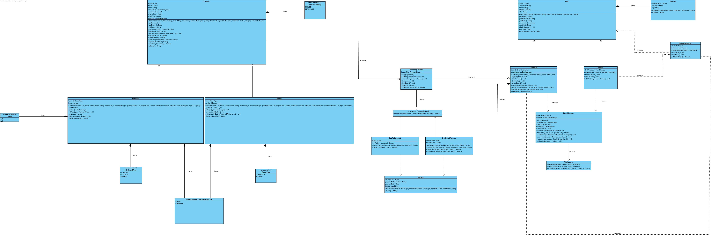

# Java OOP Project

This project was developed as part of my **Object-Oriented Programming (OOP)** coursework at **Loughborough University**.  
It demonstrates key OOP principles — **encapsulation, inheritance, polymorphism, and abstraction** — through a practical Java application built using the Eclipse IDE.

---

## 🚀 Overview
The project simulates a small-scale system (e.g. shopping application / student management / booking system — depending on your actual theme) that allows users to perform core operations while maintaining clean object-oriented design and modularity.

---

## 🧩 Key Features
- ✅ Designed using **OOP principles** (Encapsulation, Inheritance, Polymorphism, Abstraction)
- ✅ Implements **modular classes** and reusable methods
- ✅ Demonstrates **error handling** and **input validation**
- ✅ Includes **file handling** for data persistence (if applicable)
- ✅ Clear **console-based or GUI-based** interface (depending on your implementation)
- ✅ Fully tested and documented in Java

---

## 🛠️ Technologies Used
- **Language:** Java  
- **IDE:** Eclipse  
- **Paradigm:** Object-Oriented Programming  
- **Version Control:** Git & GitHub  

---

## 🧩 System Design — UML Class Diagram

The following diagram illustrates the high-level architecture and object-oriented relationships within the Shopping System:




---

## 📚 OOP Concepts Demonstrated
| Concept | Implementation Example |
|----------|------------------------|
| **Encapsulation** | Private fields with public getters/setters |
| **Inheritance** | Parent and child classes sharing methods |
| **Polymorphism** | Method overriding and dynamic dispatch |
| **Abstraction** | Use of abstract classes or interfaces |

---

## ⚙️ How to Run
1. Clone this repository:
   ```bash
   git clone https://github.com/SamAuto23/JAVA-OOP-Project-.git

2.Open the project in Eclipse (or your preferred IDE).
3.Build and run the main class.

📈 Learning Outcomes

1.Developed a strong understanding of object-oriented design principles

2.Enhanced ability to structure and scale Java applications

3.Gained experience with Git version control and collaborative workflows

workflows

👨‍💻 Author

Tolu Omotunde
BSc Computer Science — Loughborough University
Email:toluomot2005@gmail.com
Github:https://github.com/SamAuto23

📝 License

This project is for educational purposes only and not intended for commercial use.

---

Would you like me to tailor the **Overview and Features** section specifically to your actual Java project’s theme (e.g. Shopping App, Student System, etc.) so it looks even more polished?

